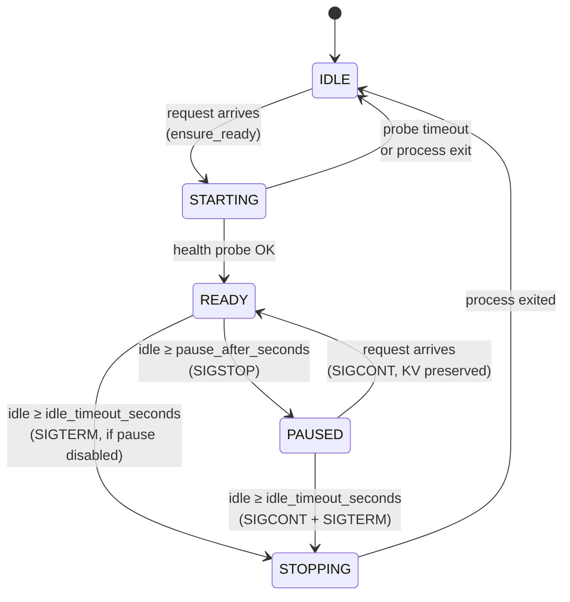
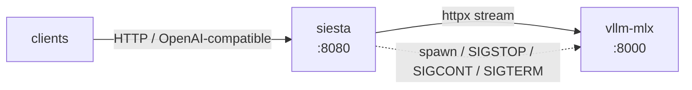

# vllm-mlx-siesta

Idle-lifecycle reverse proxy for [vllm-mlx](https://github.com/waybarrios/vllm-mlx) on macOS Apple Silicon.

Keeps your model hot while you're actively using it, naps after a short idle, and frees the memory entirely after a longer idle. Next request either resumes the nap instantly or cold-starts fresh.

## Why

vllm-mlx gives high throughput on Apple Silicon but stays resident once loaded. On a workstation where you want both fast follow-ups *and* RAM back when you walk away, neither "always on" nor "always cold" is right. Siesta adds two knobs:

- `pause_after_seconds` — after this much idle, send `SIGSTOP`. CPU frees instantly, process lives, wake is `<100ms` via `SIGCONT`. RAM is not freed immediately but macOS may compress inactive pages over time.
- `idle_timeout_seconds` — after this much idle (whether already paused or not), send `SIGTERM`. RAM fully freed. Next request cold-starts a new process (weights usually still in the fs page cache, so this is faster than a fresh boot).

## State machine



The idle watcher only acts while `in_flight == 0`, so a streaming request that outlives the idle timer never gets paused or killed.

## How requests flow



On each request: `siesta` resolves the current state, spawns or resumes the upstream as needed, increments an in-flight counter, streams the response, then decrements. An asyncio background task checks `now - last_activity` against `pause_after_seconds` and `idle_timeout_seconds` at `idle_check_interval_seconds` granularity.

## Install

Requires Python 3.11+.

```sh
git clone https://github.com/axiomantic/vllm-mlx-siesta.git
cd vllm-mlx-siesta
pip install -e .
```

## Configure

Copy `examples/config.toml` and edit `upstream_cmd` to launch your vllm-mlx process. The example assumes vllm-mlx is on PATH.

Resolution order: CLI flags > `SIESTA_*` env vars > TOML file > defaults.

## Run

```sh
vllm-mlx-siesta --config ~/.config/vllm-mlx-siesta/config.toml
```

Or without a config file:

```sh
vllm-mlx-siesta \
  --listen-port 8080 \
  --upstream-port 8000 \
  --pause-after-seconds 60 \
  --idle-timeout-seconds 600 \
  --upstream-cmd vllm-mlx serve --model mlx-community/Qwen2.5-7B-Instruct-4bit --host 127.0.0.1 --port 8000
```

Pass `--pause-after-seconds 0` (or set `pause_after_seconds = 0` in config) to disable the nap step and unload directly on idle.

Point your OpenAI-compatible client at `http://127.0.0.1:8080/v1/...`.

## LaunchAgent (start at login)

```sh
mkdir -p ~/.config/vllm-mlx-siesta
cp examples/config.toml ~/.config/vllm-mlx-siesta/config.toml
# edit ~/.config/vllm-mlx-siesta/config.toml, then:
./launchd/install.sh
```

Environment variables that customize the install: `SIESTA_BIN`, `CONFIG_PATH`, `LOG_DIR`, `WORKDIR`, `AGENT_PATH`.

Uninstall:

```sh
launchctl unload ~/Library/LaunchAgents/com.axiomantic.vllm-mlx-siesta.plist
rm ~/Library/LaunchAgents/com.axiomantic.vllm-mlx-siesta.plist
```

## Health

```sh
curl http://127.0.0.1:8080/healthz
```

Returns supervisor state (`idle` / `starting` / `ready` / `paused` / `stopping`), upstream PID, in-flight request count, last-activity timestamp, and start/stop counters.

## Wake-up behavior

- **From `paused`:** the first request sends `SIGCONT` and proceeds. Typically under 100ms. The KV cache is preserved because the process itself never died.
- **From `idle`:** the first request spawns a new vllm-mlx process and blocks on its health probe (`/v1/models` by default). Usually 5–15s on Apple Silicon because MLX mmaps safetensors and macOS's buffer cache keeps the weight bytes resident across the restart — only process init and Metal context setup pay real cost.
- If startup fails (bad command, port conflict, model OOM), the request returns `503` with `Retry-After: 5` so well-behaved clients retry.

## What about the KV cache across a full unload?

Gone. Serializing KV across process exits isn't a standard vllm-mlx path and would cost many GB. That's the explicit tradeoff: use `paused` for fast follow-ups (KV preserved), accept `idle` as a clean slate.

## Scope

v0.1 wraps one upstream process. Multi-model routing (multiple upstreams, switch by requested model name) is a future concern — for now the upstream itself decides whether to serve one or many.

## License

MIT. See [LICENSE](LICENSE).
